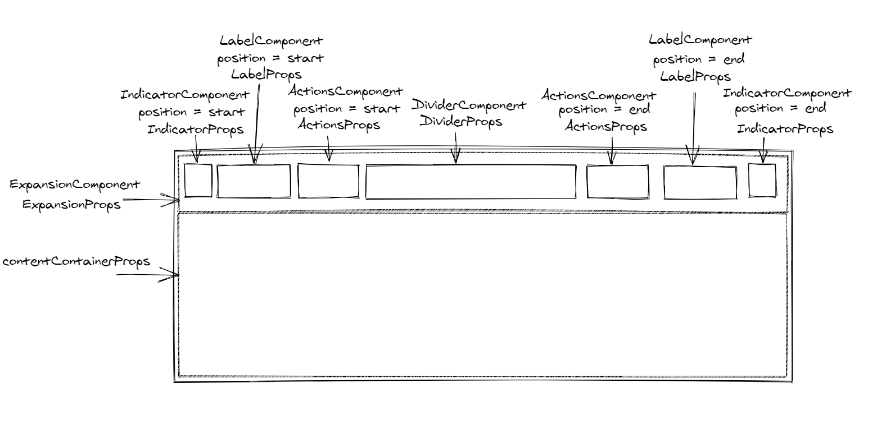
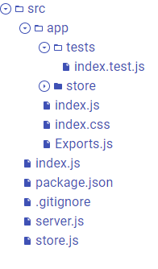
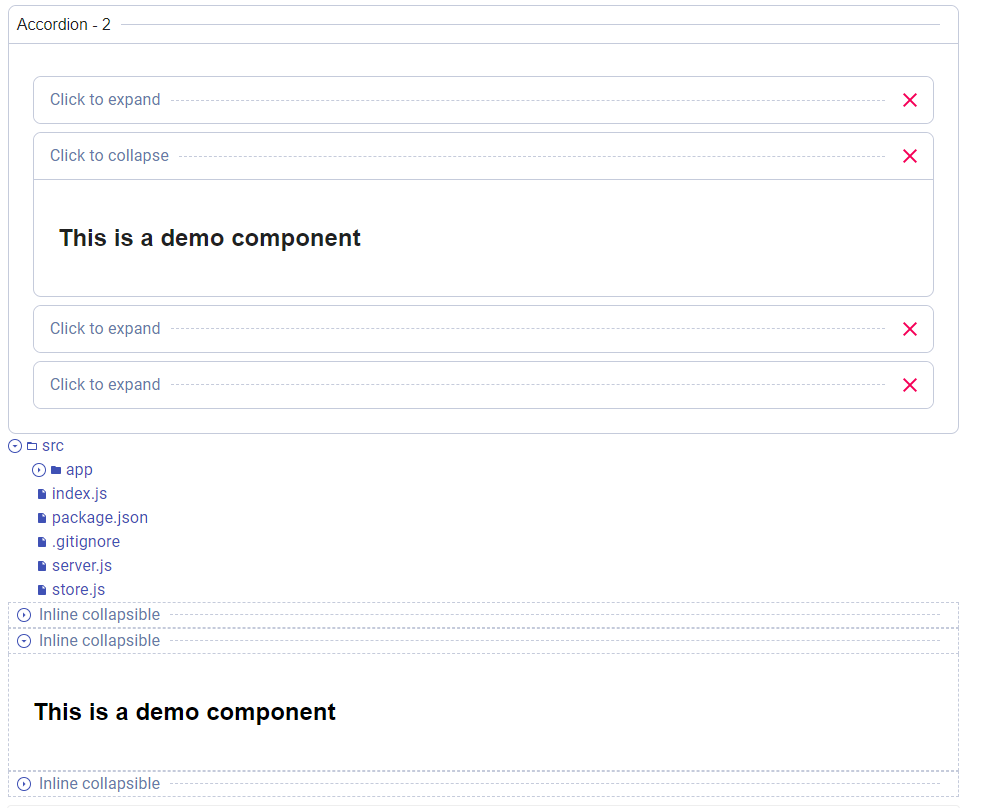

# react-expansion

> Fully customizable and reusable expand/collapse component

[](https://www.npmjs.com/package/react-expansion)
[](https://standardjs.com)

## What is this

`react-expansion` sees the expand/collapse system as the composition of multiple bricks. the picture bellow resumes it all.




Picture generated with [excalidraw](https://github.com/excalidraw/excalidraw).

## Install

```bash
npm install --save react-expansion
```
or
```bash
yarn add react-expansion
```
## Demo
This ongoing codeSandbox will contain reusable examples

<a href="https://codesandbox.io/s/vigilant-paper-ynigk">
  
</a>

## Props and Usage hints

To use `react-expansion`, you need to define a few components on your own because we prefer to stay agnostic to the UI.

These components will receive the following props:

|Prop                | value|
|--------------------|------------------|
|`expanded`          | a boolean that indicates whether the component is expanded/collapsed  |
|`toggleExpansion`   | if controlled, will toggle the expansion state  |
|`position`          | will be spread to IndicatorComponent, LabelComponent and ActionsComponent, and indicates respectively the position of the nested component  |

The `ExpandCollapse` component props are:

|Prop                    | PropType                  | Default value    | Usage            |
|------------------------|---------------------------|------------------|------------------|
|`expanded`              | `bool`                    | `undefined`      | If present, the expand collapse becomes controlled by this prop |
|`initialValue`          | `bool`                    | `false`          | If not controlled, this is the initial expansion state when the component is mounted |
|`labelPosition`         | `oneOf(['start', 'end'])` | `start`          | Indicates the position of the label component and/or label children |
|`actionsPosition`       | `oneOf(['start', 'end'])` | `end`            | Indicates the position of the action component and/or the actions children |
|`indicatorPosition`     | `oneOf(['start', 'end'])` | `end`            | Indicates the position of the indicator component |
|`Component`             | `String or func`          | `React.Fragment` | Is the component in which the Expansion header and content will be wrapped into |
|`ComponentProps`        | `object`                  | `{}`             | The props of the top level wrapper component |
|`ExpansionComponent`    | `String or func`          | `undefined`      | The component to be mounted to wrap the Expansion Header (that contains the indicator, label, actions, divider) |
|`ExpansionProps`        | `object`                  | `{}`             | The props to be passed to the `ExpansionComponent` plus the automatic props described the in the previous table |
|`IndicatorComponent`    | `String or func`          | `undefined`      | The component that is supposed to indicate the expansion state and toggles it |
|`IndicatorProps`        | `object`                  | `{}`             | The props to be passed to the `IndicatorComponent` plus the automatic props described the in the previous table |
|`LabelComponent`        | `String or func`          | `undefined`      | The component in which the `label` prop is wrapped |
|`LabelProps`            | `object`                  | `{}`             | The props to be passed to the `LabelComponent` plus the automatic props described the in the previous table |
|`ActionsComponent`      | `String or func`          | `undefined`      | The component in which the `actions` prop is wrapped |
|`ActionsProps`          | `object`                  | `{}`             | The props to be passed to the `ActionComponent` plus the automatic props described the in the previous table |
|`DividerComponent`      | `String or func`          | `undefined`      | The component that will be mounted as a divider (may be an hr or any custom object (even a form)) |
|`DividerProps`          | `object`                  | `{}`             | The props to be passed to the `DividerComponent` plus the automatic props described the in the previous table |
|`contentContainerProps` | `object`                  | `{}`             | The props to be passed to the `div` containing the content, these props are only passed if the component is `expaned` |
|`actions`               | `any`                     | `undefined`      | The actions children to be mounted in the actions area |
|`children`              | `any`                     | `undefined`      | What will be hidden/visible depending on the expansion state |
|`label`                 | `any`                     | `undefined`      | The label to display in its position |
|`keepMounted`           | `bool`                    | `undefined`      | If true, the content will stay into the dom, but the div containing it will have a `display: none` style |
|`onExpandChange`        | `func`                    | `undefined`      | will be called with the next expansion state whenever the expand collapse changed |
|`contentDisplay`        | `string`                  | `undefined`      | The display style property's value that will be given the content container when visible |


You can also imperatively handle the expansion state if not controlled.
The `useImperativeHandle` hook exposes the following functions:
- expand
- collapse
- toggleExpansion

and can be used like this:
```jsx
const myRef = React.useRef()
function expand() {
  myRef.current.expand()
}
function collapse() {
  myRef.current.collapse()
}
function toggle() {
  myRef.current.toggleExpansion()
}
// later
<SomeButton onClick={toggle}>Toggle</SomeButton>
<SomeButton onClick={expand}>Expand</SomeButton>
<SomeButton onClick={collapse}>Collapse</SomeButton>
<ExpandCollapse ref={myRef} {...}>Some tags and children</ExpandCollapse>
```


## Limitations and roadmap
- The `ExpandCollapse` component wraps the children in a `div` so its `display` style is managed and thus we can offer the `keepMounted` ability
- There is no support for animations, but we hope it will be released in the `v2` (instead, you can pass the needed css using className or style via the `contentContainerProps`)


## Usage examples

There is a lot of examples that can be made with this `ExpandCollapse`.

Let's create a navigation file system that will display a files tree (folders & files).

I will be using [Material-ui](https://github.com/mui-org/material-ui) to illustrate my examples for faster dev. 

First: the `IndicatorComponent`

```jsx
const useIndicatorStyles = makeStyles({
  iconButton: {
    border: `1px solid`,
    padding: '0px',
  },
  icon: {
    width: '12px',
    height: '12px'
  }
});
function FileSystemIndicator({ expanded, toggleExpansion, variant = 'file'}) {
  const classes = useIndicatorStyles()
  if (variant === 'file') {
    return null; // no indicator when it's a file
  }
  return (
    <IconButton color="primary"  className={classes.iconButton} onClick={toggleExpansion} size="small">
      <SvgIcon className={classes.icon}>
        {expanded ? <ArrowDown /> : <ArrowRight />}
      </SvgIcon>
    </IconButton>
  )
}
```

Then: the `LabelComponent`
```jsx
import File from '@material-ui/icons/InsertDriveFile'
import FolderOpen from '@material-ui/icons/FolderOpen'
import FolderClosed from '@material-ui/icons/Folder'

const useStyles = makeStyles({
  root: {
    cursor: 'pointer',
    display: 'flex',
    alignItems: 'center',
    marginLeft: 4
  },
  icon: {
    width: '12px',
    height: '12px',
    marginRight: 4
  }
})
function FileSystemLabel({filename, fileUrl, variant = 'file', expanded, toggleExpansion}) {
  const classes = useStyles()
  function onClick() {
    if (fileUrl) {
      alert(`We can load a file content here from it's url ${fileUrl}`)
    } else {
      toggleExpansion()
    }
  }
  return (
    <Typography onClick={onClick} color="primary" component="div" className={classes.root}>
      <SvgIcon className={classes.icon}>
        {variant === 'folder' && expanded && <FolderOpen/>}
        {variant === 'folder' && !expanded && <FolderClosed/>}
        {variant === 'file' && <File/>}
      </SvgIcon>
      <Typography color="primary" component="span">
        {filename}
      </Typography>
    </Typography>
  )
}
```
Then: the `DividerComponent` which will be nothing:
```jsx
function Nothing() {
  return null;
}
```

And then, the `FileUnit` that returns our `ExpandCollapse`:
```jsx
function FileUnit({children, filename, variant, fileUrl, ...rest}) {
  return (
    <ExpandCollapse
      keepMounted
      Component="div"
      indicatorPosition='start'
      ExpansionComponent='div'
      ExpansionProps={{style: {display: 'flex', alignItems: 'center'}}}
      LabelComponent={FileSystemLabel}
      LabelProps={{filename, variant, fileUrl}}
      label={filename}
      IndicatorComponent={FileSystemIndicator}
      IndicatorProps={{variant}}
      contentContainerProps={{
        style: {
          marginLeft: 24
        }
      }}
      {...rest}
    >
      {children}
    </ExpandCollapse>
  )
}
```
 
The resulting ExpandCollapse with a minimal example will give this output



We can also create a large variant of expand collapse and combine them.
Here is a picture, I am still looking to create multiple other examples in a demo package.




## License

MIT © [incepter](https://github.com/incepter)
